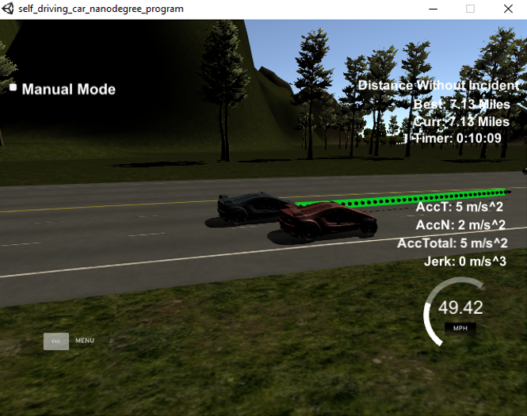

# CarND-Path-Planning-Project
Self-Driving Car Engineer Nanodegree Program
   

### Goals
In this project your goal is to safely navigate around a virtual highway with other traffic that is driving +-10 MPH of the 50 MPH speed limit. You will be provided the car's localization and sensor fusion data, there is also a sparse map list of waypoints around the highway. The car should try to go as close as possible to the 50 MPH speed limit, which means passing slower traffic when possible, note that other cars will try to change lanes too. The car should avoid hitting other cars at all cost as well as driving inside of the marked road lanes at all times, unless going from one lane to another. The car should be able to make one complete loop around the 6946m highway. Since the car is trying to go 50 MPH, it should take a little over 5 minutes to complete 1 loop. Also the car should not experience total acceleration over 10 m/s^2 and jerk that is greater than 10 m/s^3.

#### The map of the highway is in data/highway_map.txt

## Basic Build Instructions

1. Clone this repo.
2. Make a build directory: `mkdir build && cd build`
3. Compile: `cmake .. && make`
4. Run it: `./path_planning`.

## Project Rubics:

## Compilation

### The code compiles correctly.

Code compiles without errors with cmake and make.

## Valid trajectories

### The car is able to drive at least 4.32 miles without incident.
I ran the simulator for more than 7 miles without incidents:

### The car drives according to the speed limit.
The speed limit in the code is set to 49.5 mile/hour. The car never drives faster than the limit.

### Max Acceleration and Jerk are not Exceeded.
Yes. The max acceleration and jerk are not exceeded.

### Car does not have collisions.
No collisions occurs during the 7 miles driving.

### The car stays in its lane, except for the time between changing lanes.
The criteria is satisfied. The car doesn't spend more than a 3 second length out side the lane lanes during changing lanes, and every other time the car stays inside one of the 3 lanes on the right hand side of the road.

### The car is able to change lanes
The car is able to smoothly change lanes when it makes sense to do so.

## Reflection

The path planning algorithm is developed based on the information from the "project walkthrough". The code starts at [src/main.cpp] line 246 to the line 426. The code has three sections: prediction, behavior planning and Trajectory generation.

### Prediction section [from line 255 to line 290]
This part of the code estimate other cars' locations using sensor fusion data. It check the locations of all the other cars which is less than 30 meters ahead or behind our car: in front and the same lane,  in the right lane, or in the left lane. 

### Behavior Planning section [from line 291 to line 318]
In this behavior planning section, based on the prediction of the nearby traffic, this code could make a decision for accelerating, decelerating, or make a lane change. The max speed and max acceleration step is defined to avoid violating speed limit and jerk. In order to avoid collision, it will reduce the speed if finding another ahead and the distance is less than 30 meters.

### Trajectory Generation [from line 319 to line 426]
In this section, the trajectory is generated based on the speed and lane from the behavior planning, car locations and previous trajectory. The trajectory spline is calculated using the previous trajectory and three points at 30m, 60m and 90m respetively. The coordinates are transformed to local car coordinates for the spline calculation. The velocity of the car is updated using the information from behavior planning section. 

